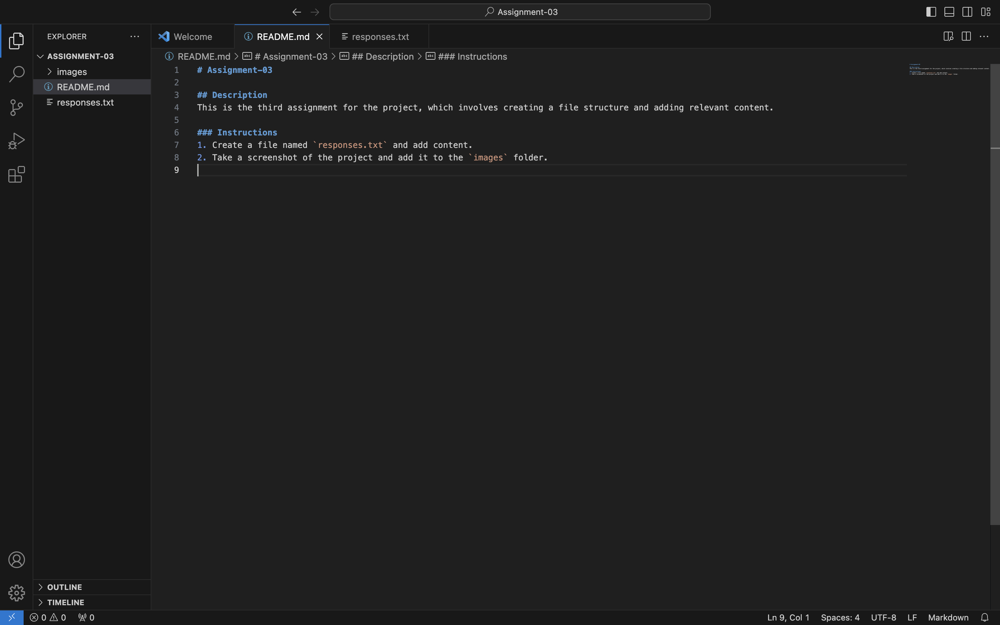

# Assignment-03

## Description
This is the third assignment for the project, which involves creating a file structure and adding relevant content.

### Instructions
1. Create a file named `responses.txt` and add content.
2. Take a screenshot of the project and add it to the `images` folder.

[View Responses](./responses.txt)

